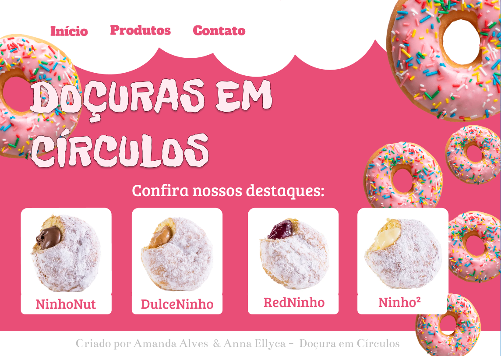
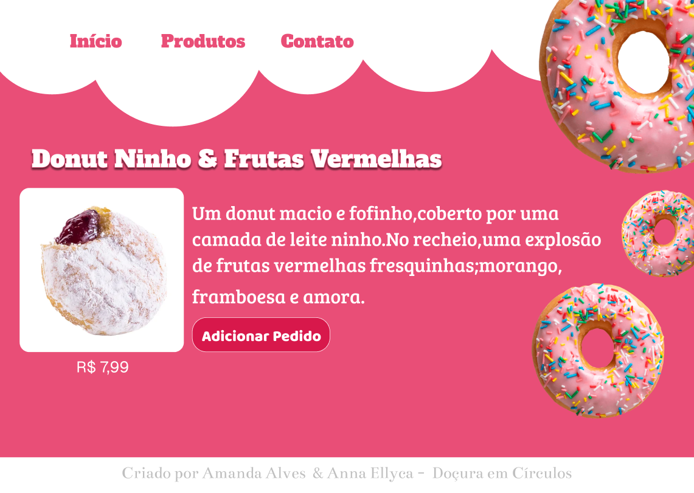
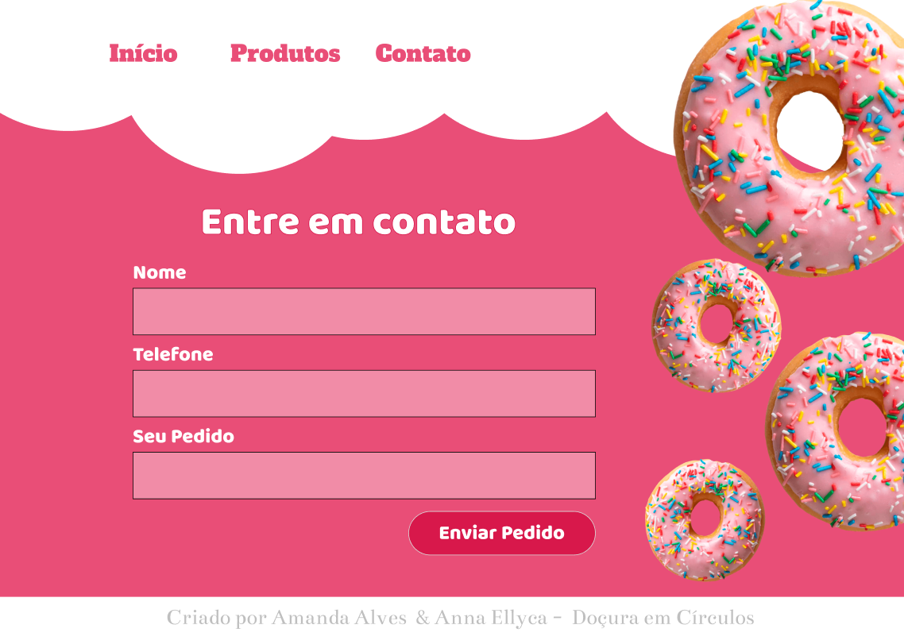
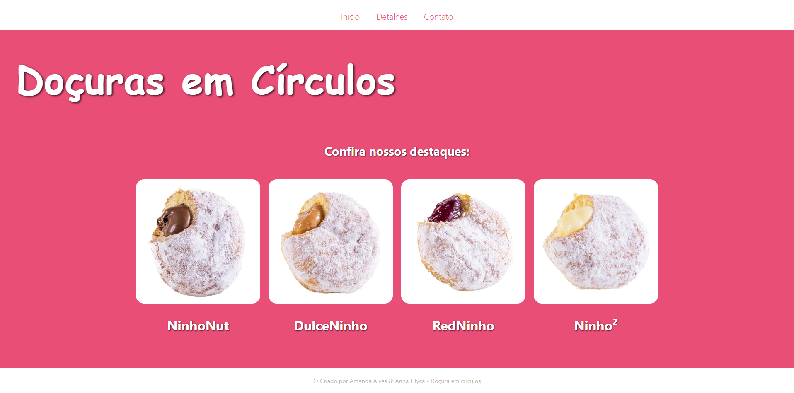
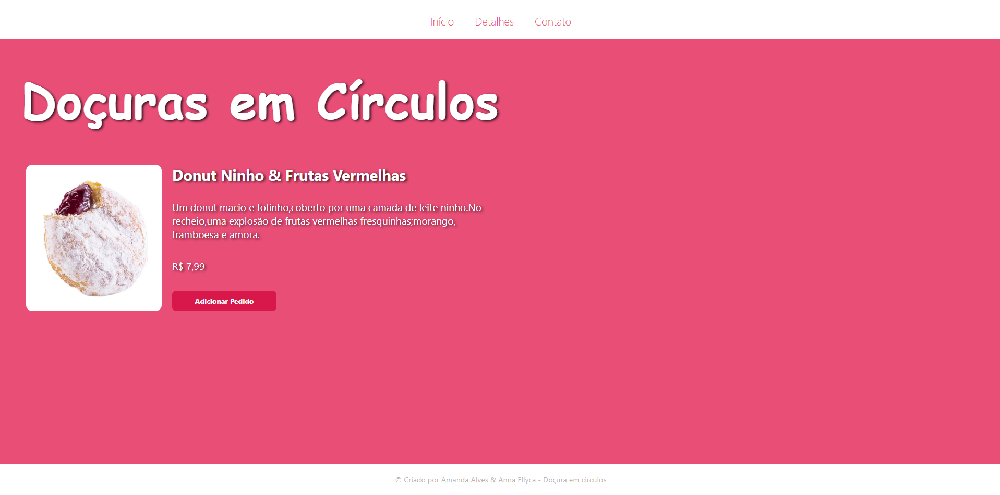
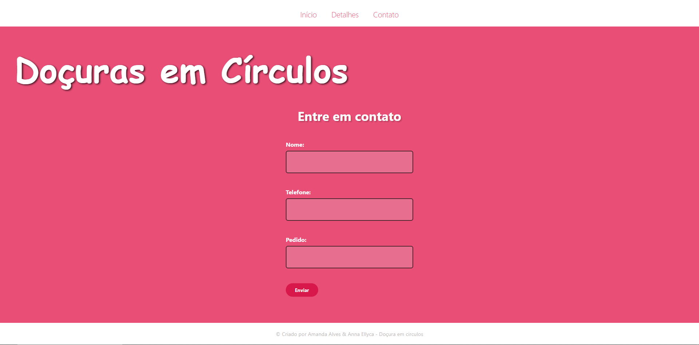

## 🍩Doçura em Círculos🍩

> Implementação do protótipo do Figma — Projeto Final (Desenvolvimento Web I)

---

### 🍫 Descrição
Doçura em círculos é uma adaptação de um protótipo criado no Figma. O projeto contém páginas em HTML e CSS (sem JavaScript) que exibem uma tela inicial, página de detalhes e formulário de contato. A estrutura segue o protótipo e a paleta definida no Figma.

---

## Objetivo do Projeto
Colocar em prática os conceitos aprendidos na disciplina **Desenvolvimento Web I**.  
Criar um site completo em **HTML** e **CSS**, respeitando design, paleta de cores e estrutura do protótipo do Figma.  


---

###✅ Requisitos (resumido)
- Apenas **HTML** e **CSS** .
- Três páginas principais: `index.html`, `detalhes.html`, `contato.html`.
- Cabeçalho (`header`) e rodapé (`footer`) compartilhados entre páginas.
- Página inicial com **cards** (imagem, título, descrição).
- Página de detalhes com imagem principal, título, descrição e informações adicionais.
- Página de contato com formulário (nome, e-mail, assunto, mensagem).
- Arquivo CSS externo (`css/style.css`).
- Responsividade básica com **Flexbox**.

---

## Estrutura de pastas (modelo)
```
projeto_final/
├── index.html
├── html/
│   ├── contato.html
│   ├── inicio.html
├── css/
│   └── style.css
├── img/                    
│   ├── DulceNinho.jpg
│   ├── NinhoNut.jpg
│   ├── RedNinho.jpg
│   └── (outras imagens...)
├── README.md             
```
---

## Conteúdo dos arquivos (breve)
- **index.html** — Página inicial com cards dos itens.  
- **img/** — Pasta exibindo imagens.  
- **contato.html** — Formulário de contato com `label` associado aos campos. (Ex.: `contato.html`).  
- **css/style.css** — Estilos compartilhados entre as páginas.  

---


### Protótipo (Figma)




### Implementação (HTML/CSS)





## 🎨 Semelhanças e Diferenças entre o Protótipo (Figma) e o Site Final (HTML/CSS)

### ✅ Semelhanças
- Estrutura principal das páginas foi mantida.
- A paleta de cores foi mantida no site oficial.
- As páginas possuem navegação igual ao layout do Figma.
- As imagens dos donuts aparecem em destaques nos dois.
- O conteúdo segue o mesmo padrão do design no Figma.

### ⚠️ Diferenças
- O site final usa espaçamentos,proporções e margens um pouco diferentes.
- Algumas imagens precisaram ser ajustadas para tamanhos mais adequados ao layout final.
- No site não possui as ondas e os donuts decorativos no fundo.
- Tipografia não esta exatamente igual do prototipo.
- No prototipo os elementos estao mais centralizados,no site,alguns ficaram mais na esquerda e direita..
- No Figma havia efeitos mais visuais que foram adaptados.
